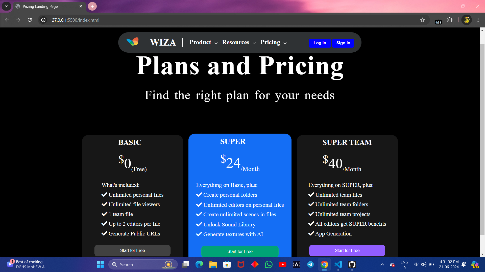

# Pricing-Landing-Page

## Overview
This project is a responsive landing page designed to showcase various pricing plans for a service or product. It is built using HTML and CSS and includes interactive elements to enhance the user experience.

## Features
- **Navigation Bar:** Fixed navigation bar with logo, navigation links, and buttons for logging in and signing up.
- **Header Section:** Introductory section with a main title and subtitle.
- **Pricing Section:** Displays three pricing plans (Basic, Super, Super Team) as interactive cards, each with a list of features and a call-to-action button.
- **Responsive Design:** Adjusts layout for different screen sizes, with hidden elements on smaller screens for a cleaner look.
- **Interactive Elements:** Hover effects on buttons and cards.

## Technologies Used
- **HTML5:** Structure of the webpage.
- **CSS3:** Styling and layout, using Flexbox for card layout and media queries for responsiveness.
- **Font Awesome:** Icons for the feature lists.

- ## Usage
This landing page can be used as a template for any service or product requiring a pricing page. You can customize the content, styling, and layout to suit your specific needs.

## Screenshots

## Contributing
Contributions are welcome! If you have suggestions for improvements or find any issues, please feel free to open an issue or submit a pull request.

## Acknowledgements
- Icons by [Font Awesome](https://fontawesome.com/)
- Inspiration and design ideas from various web design resources.

## Contact
For any inquiries or feedback, please contact [your email](mailto:pvc14102002@gmail.com).
